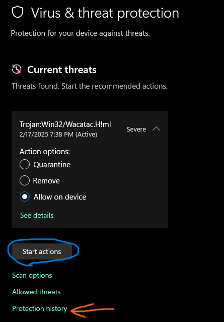
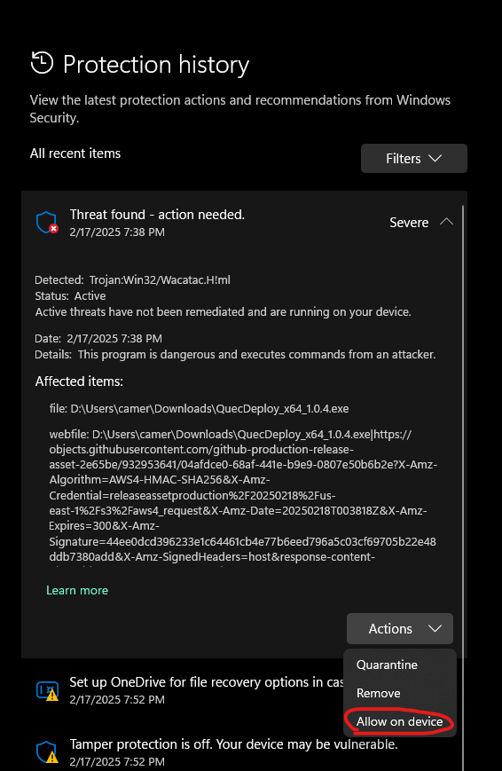

## False positive Virus issue :

Reference from original reported issue here:  [Issue 6](https://github.com/iamromulan/RM520N-GL/issues/6)
Windows Defender thinks this is a virus. ==**It is not a virus.**== Its a false positive as a result of:
1. I do not sign the exe; buy me a cert if you would like (open an issue)
2. The tool used to download the files from my mega.nz account ([megatools](https://xff.cz/megatools)) is converted to a base64 and embedded into the ps1 script. The exe is created from the ps1 file using  [PSPackager](https://ironmansoftware.com/release/powershell-packager)

To fix the issue:
After the download fails, Open Windows Defender:

Anything that says allow click it. If you don't see this then go into protection history and allow it from there:

==**Once Done, try your download again.**==