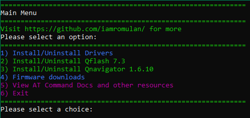

# QuecDeploy: Quickly Install/Deploy Quectel Software/Firmware

## Features: 
- Megatools.exe integrated for downloads from mega.nz
- Download and install the following drivers easily:
     - NDIS Driver 2.7 (For AT+QCFG="usbnet",0 mode)
     - ECM Driver 1.0 (For AT+QCFG="usbnet",1 mode)
          - Note: After installing driver must be manually selected in Device Manager
          - Note: NDIS Driver must also be installed to access ports
     - MBIM Driver 1.3 (For AT+QCFG="usbnet",2 mode)
     - RNDIS Driver 1.1 (For AT+QCFG="usbnet",3 mode)
    :warning: Only have one of these drivers installed at once. The ECM driver is the exception to this rule.

- Download and install Qflash 7.3 to C:\Quectel\Qflash\
    - adb and fastboot are included with Qflash 7.3 and automatically added to the system path
    - Desktop and Start Menu shortcuts are automatically created for Qflash 7.3
 
- Download and install Qnavigator 1.6.10 to C:\Quectel\Qflash\
    - Desktop and Start Menu shortcuts are automatically created for Qnavigator

- Download and Unzip firmware (Saves to C:\Quectel\firmware\<modem>\<type>\<firmware_version>\) for the following modems:
     - RM502Q-AE
     - RM520N-GL
     - RM521F-GL
     - RM551E-GL

- View AT Command Docs and other resources for: 
- (Opens up your web browser to https://github.com/iamromulan/<modem>/)
     - RM502Q-AE
     - RM520N-GL
     - RM521F-GL
     - RM551E-GL
 ## Planed additions for future versions:

- ~~Integrate adb and fastboot binaries for quick management of modems via adb~~ adb and fastboot included with Qflash now.
- Integrate a COM port communication method for direct AT commands from QuecDeploy
- Automatic modem detection, AT commands, and modem setup wizard.
